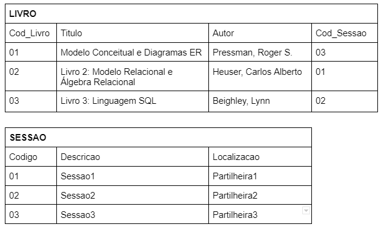

# Desafio-3-Code-Park-1

Código dos comandos no diretório acima.

De acordo com os comandos aprendidos, programe códigos SQL para criar um banco de dados chamado ESCOLA e deixe-o pronto para o uso. Depois, pesquise qual é o comando utilizado para inserir uma tabela no banco de dados e siga as instruções:

1. Crie uma tabela chamada ALUNO:
2. Defina os atributos da tabela:
3. Adicione a chave primária de nome ID (identificador):
4. Adicione um atributo nome do tipo varchar:
5. Adicione um atributo e-mail do tipo varchar:
6. Adicione um atributo endereço do tipo varchar:

Trabalhe esse código em seu IDE, suba ele para sua conta no GitHub e compartilhe o link desse projeto no campo ao lado para que outros desenvolvedores possam analisá-lo.

